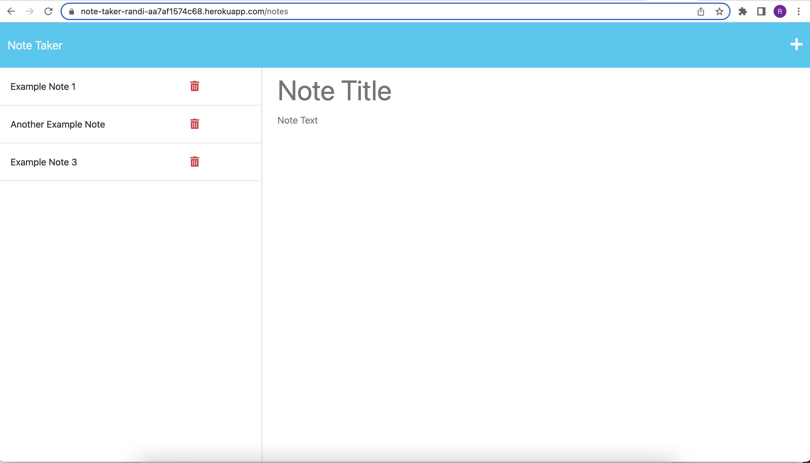
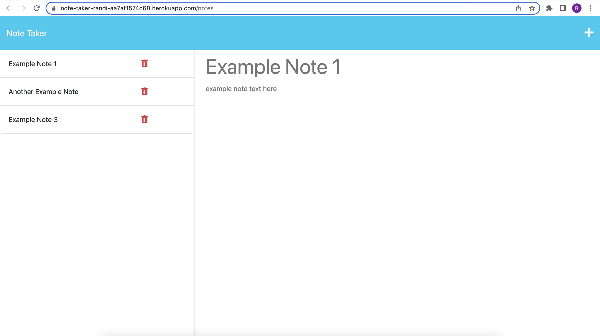

# Note Taker: Module 11 (Express)

## Description

This was our first project using `Express`, and building our own APIs. This app provides a simple way to keep track of, add to, and delete notes for the user. The data persists through post calls to our API, adding new notes to the server database.

I had some issues with truncated data throwing errors in this assignment, but it seemed to be only with my local host. I worked around the error by catching it so it didn't kick me out of my local host server. The error doesn't persist in the deployed version of my app.

This project was great practice using `Express`, and building and modifying server databases through API calls, rather than local storage, which we've worked with before.

## Table of Contents

- [User Story](#user-story)
- [Acceptance Criteria](#acceptance-criteria)
- [Installation](#installation)
- [Usage](#usage)
- [Features](#features)

## User Story
AS A small business owner  
I WANT to be able to write and save notes  
SO THAT I can organize my thoughts and keep track of tasks I need to complete  

## Acceptance Criteria
GIVEN a note-taking application  
WHEN I open the Note Taker  
THEN I am presented with a landing page with a link to a notes page  
WHEN I click on the link to the notes page  
THEN I am presented with a page with existing notes listed in the left-hand column, plus empty fields to enter a new note title and the note’s text in the right-hand column  
WHEN I enter a new note title and the note’s text  
THEN a Save icon appears in the navigation at the top of the page  
WHEN I click on the Save icon  
THEN the new note I have entered is saved and appears in the left-hand column with the other existing notes  
WHEN I click on an existing note in the list in the left-hand column  
THEN that note appears in the right-hand column  
WHEN I click on the Write icon in the navigation at the top of the page  
THEN I am presented with empty fields to enter a new note title and the note’s text in the right-hand column  

## Installation

To install, first clone the code here: https://github.com/randirose/note-taker-randi  

You'll need to have `node.js` downloaded on your local machine. Then, make sure all libraries are installed by running `npm install`.  

You should now be able to run on `http://localhost:3001/`. You can use the browser or make API calls with Insomnia/Postman.  

## Usage

Visit the deployed app here: https://note-taker-randi-aa7af1574c68.herokuapp.com/  

- Click the `+` icon in the upper right corner to add a new note  
- Once you've added the `Note Title` and `Note Text`, you can click `save` (floppy icon) in the upper right corner  
- You'll see your new note saved in the left hand column. Click on the note to view it in the right hand column  
- To delete a note, click `delete` (trash can icon) next to the note's name in the left hand column  

See screenshots of expected functionality below:

  

## Features

- Bonus feature: `router.delete` call in `api/notes.js` and `helpers/deleteNote`. Functionality deletes note from database when user deletes note on the front end
